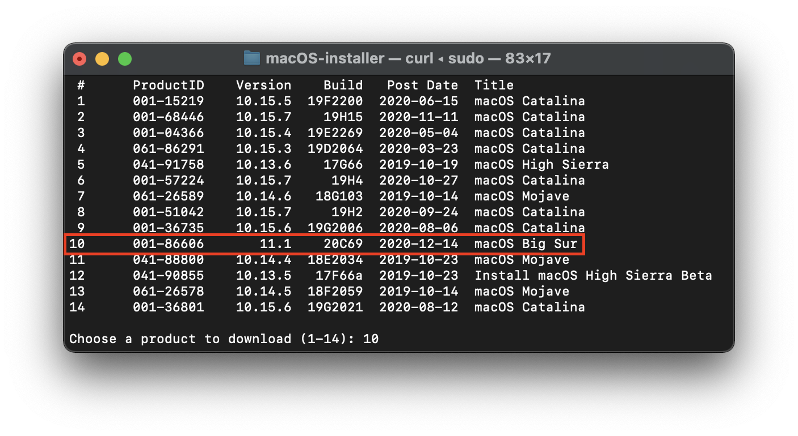

# MacOS

Bien que vous n'ayez pas besoin d'une nouvelle installation de macOS pour utiliser OpenCore, certains utilisateurs préfèrent avoir une nouvelle installation avec les mises à niveau de leur boot-loader.

Pour commencer, nous allons nous procurer une copie de macOS. Vous pouvez ignorer cela et vous diriger vers le formatage de l'USB si vous créez simplement une clé OpenCore amorçable et non un programme d'installation. Pour tous les autres, vous pouvez soit télécharger macOS depuis l'App Store, soit avec le script de Munki.

## Téléchargement de macOS: système d'exploitation moderne

* Cette méthode vous permet de télécharger macOS 10.13 et versions ultérieures, pour 10.12 et versions antérieures, voir [Téléchargement de macOS : Legacy OS](https://dortania.github.io/OpenCore-Install-Guide/installer-guide/mac-install.html#downloading-macos-legacy-os)

À partir d'une machine macOS qui répond aux exigences de la version du système d'exploitation que vous souhaitez installer, accédez directement à l'App Store et téléchargez la version du système d'exploitation souhaitée et passez à Configuration du programme d'installation.

Pour les machines qui nécessitent une version spécifique du système d'exploitation ou qui ne peuvent pas être téléchargées depuis l'App Store, vous pouvez utiliser l'utilitaire InstallInstallMacOS de Munki.

<details>

<summary>Remarque pour les utilisateurs utilisant macOS Monterey 12.3 ou supérieur</summary>

À partir de macOS Monterey 12.3, Apple a supprimé la prise en charge de python2.7, donc sans cela, installinstallmacos.py renverra l'erreur suivante :

```
This tool requires the Python xattr module. Perhaps run 'pip install xattr' to install it.
```

Pour résoudre le problème, nous vous recommandons d'installer les outils de ligne de commande pour Xcode en exécutant xcode-select --install dans un terminal, puis exécutez pip3 install xattr

Après cela, vous pouvez exécuter la même commande ci-dessous mais avec python3 au lieu de simplement python

```shell
mkdir -p ~/macOS-installer && cd ~/macOS-installer && curl https://raw.githubusercontent.com/munki/macadmin-scripts/main/installinstallmacos.py > installinstallmacos.py && sudo python3 installinstallmacos.py
```

</details>

Pour l'exécuter, copiez et collez simplement la commande ci-dessous dans une fenêtre de terminal :

```bash
mkdir -p ~/macOS-installer && cd ~/macOS-installer && curl https://raw.githubusercontent.com/munki/macadmin-scripts/main/installinstallmacos.py > installinstallmacos.py && sudo python installinstallmacos.py
```



Comme vous pouvez le voir, nous obtenons une belle liste d'installateurs macOS. Si vous avez besoin d'une version particulière de macOS, vous pouvez la sélectionner en tapant le numéro à côté. Pour cet exemple, nous choisirons 10 :

.png>)

* macOS 12, Monterey Remarque : Comme ce système d'exploitation est assez nouveau, il reste encore quelques problèmes à résoudre avec certains systèmes. Pour plus d'informations, voir ici : macOS 12 : Monterey
  * Pour les nouveaux utilisateurs, nous recommandons macOS Catalina (10.15) ou Big Sur (11)
  * ATTENTION : Avec macOS 11.3 et versions ultérieures, XhciPortLimit est rompu, ce qui entraîne des boucles de démarrage (ouvre une nouvelle fenêtre). Nous conseillons aux utilisateurs d'installer un système d'exploitation plus ancien (c'est-à-dire macOS 10.15, Catalina) ou de trouver un programme d'installation Big Sur 11.2.3 ou plus ancien.
    * À des fins éducatives, nous avons une copie fournie ici : macOS 11.2.3 InstallAssistant(macOS)(ouvre une nouvelle fenêtre)
    * Si vous avez déjà mappé vos ports USB (ouvre une nouvelle fenêtre) et désactivé XhciPortLimit, vous pouvez démarrer macOS 11.3+ sans problème

Cela va prendre un certain temps car nous téléchargeons l'intégralité du programme d'installation de macOS 8 Go+, il est donc fortement recommandé de lire le reste du guide pendant que vous attendez.

Une fois terminé, vous trouverez dans votre dossier `~/macOS-Installer/` un DMG contenant le macOS Installer, nommé `Install_macOS_11.1-20C69.dmg` par exemple. Montez-le et vous trouverez l'application d'installation.

* Remarque : Nous vous recommandons de déplacer l'application Install macOS.app dans le dossier `/Applications`, car nous exécuterons des commandes à partir de là.
* Remarque 2 : L'exécution de Cmd+Shift+G dans le Finder vous permettra d'accéder facilement à `~/macOS-installer`

.png>)

.png>)

De là, passez à [Configuration du programme d'installation](https://dortania.github.io/OpenCore-Install-Guide/installer-guide/mac-install.html#setting-up-the-installer) pour terminer votre travail. Si vous souhaitez vérifier [l'intégrité de votre téléchargement](https://github.com/notpeter/apple-installer-checksums), vous pouvez consulter ce référentiel de sommes de contrôle (ouvre une nouvelle fenêtre), mais notez qu'il s'agit de sommes de contrôle participatives et qu'elles ne constituent peut-être pas un moyen fiable de vérifier l'authenticité.

## Téléchargement de macOS: Legacy OS <a href="#downloading-macos-legacy-os" id="downloading-macos-legacy-os"></a>

Cette méthode vous permet de télécharger des versions beaucoup plus anciennes d'OS X, prenant actuellement en charge toutes les versions Intel d'OS X (10.4 à actuel)

* [Legacy macOS: Offline method](https://dortania.github.io/OpenCore-Install-Guide/installer-guide/mac-install-pkg.html)
  * 10.10-10.12 Supported
* [Legacy macOS: Online method(10.7-10.15 Supported)](https://dortania.github.io/OpenCore-Install-Guide/installer-guide/mac-install-recovery.html)
  * 10.7-11 Supported
* [Legacy macOS: Disk Images](https://dortania.github.io/OpenCore-Install-Guide/installer-guide/mac-install-dmg.html)
  * 10.4-10.6 Supported

## Configuration du programme d'installation

Nous allons maintenant formater la clé USB pour préparer à la fois le programme d'installation macOS et OpenCore. Nous voudrons utiliser macOS Extended (HFS +) avec une carte de partition GUID. Cela créera deux partitions : la principale MyVolume et une seconde appelée EFI qui est utilisée comme partition de démarrage où votre micrologiciel vérifiera les fichiers de démarrage.

* Remarque : Par défaut, Utilitaire de disque n'affiche que les partitions - appuyez sur Cmd/Win+2 pour afficher tous les périphériques (vous pouvez également appuyer sur le bouton Afficher)
* Remarque 2 : les utilisateurs qui suivent la section "MacOS hérité : méthode en ligne" peuvent passer à la section [Configuration de l'environnement EFI d'OpenCore](https://dortania.github.io/OpenCore-Install-Guide/installer-guide/mac-install.html#setting-up-opencore-s-efi-environment)

.png>)

Exécutez ensuite la commande `createinstallmedia` fournie par [Apple](https://support.apple.com/en-us/HT201372) (ouvre une nouvelle fenêtre). Notez que la commande est faite pour les USB formatés avec le nom `MyVolume` :

```bash
sudo /Applications/Install\ macOS\ Big\ Sur.app/Contents/Resources/createinstallmedia --volume /Volumes/MyVolume
```

Cela prendra un certain temps, vous voudrez peut-être prendre un café ou continuer à lire le guide (pour être juste, vous ne devriez vraiment pas suivre ce guide étape par étape sans avoir tout lu au préalable).

Vous pouvez également remplacer le chemin `createinstallmedia` par celui de l'emplacement de votre programme d'installation (même idée avec le nom du lecteur).

<details>

<summary>Commandes <code>createinstallmedia</code> legacy</summary>

Extrait du propre site d'Apple : [comment créer un programme d'installation amorçable pour macOS](https://support.apple.com/en-us/HT201372)

```bash
# Monterey
sudo /Applications/Install\ macOS\ Monterey.app/Contents/Resources/createinstallmedia --volume /Volumes/MyVolume

# Big Sur
sudo /Applications/Install\ macOS\ Big\ Sur.app/Contents/Resources/createinstallmedia --volume /Volumes/MyVolume

# Catalina
sudo /Applications/Install\ macOS\ Catalina.app/Contents/Resources/createinstallmedia --volume /Volumes/MyVolume

# Mojave
sudo /Applications/Install\ macOS\ Mojave.app/Contents/Resources/createinstallmedia --volume /Volumes/MyVolume

# High Sierra
sudo /Applications/Install\ macOS\ High\ Sierra.app/Contents/Resources/createinstallmedia --volume /Volumes/MyVolume

# Sierra
sudo /Applications/Install\ macOS\ Sierra.app/Contents/Resources/createinstallmedia --volume /Volumes/MyVolume --applicationpath /Applications/Install\ macOS\ Sierra.app

# El Capitan
sudo /Applications/Install\ OS\ X\ El\ Capitan.app/Contents/Resources/createinstallmedia --volume /Volumes/MyVolume --applicationpath /Applications/Install\ OS\ X\ El\ Capitan.app

# Yosemite
sudo /Applications/Install\ OS\ X\ Yosemite.app/Contents/Resources/createinstallmedia --volume /Volumes/MyVolume --applicationpath /Applications/Install\ OS\ X\ Yosemite.app

# Mavericks
sudo /Applications/Install\ OS\ X\ Mavericks.app/Contents/Resources/createinstallmedia --volume /Volumes/MyVolume --applicationpath /Applications/Install\ OS\ X\ Mavericks.app --nointeraction
```

</details>

## Configuration Legacy

Pour les systèmes ne prenant pas en charge le démarrage UEFI, voir ci-dessous :

<details>

<summary>Configuration du démarrage legacy</summary>

Pour commencer, vous avez besoin des éléments suivants :

* BootInstall\_IA32.tool ou BootInstall\_X64.tool
  * Cela peut être trouvé dans OpenCorePkg sous`/Utilties/LegacyBoot/`
* L'USB d'installation (Créé en haut)

Dans votre dossier de construction OpenCore, accédez à `Utilities/LegacyBoot`. Vous trouverez ici un fichier appelé `BootInstall_ARCH.tool`. Il permet d'installer DuetPkg sur le lecteur souhaité.


Exécutez maintenant l'outil dans le terminal avec sudo (sinon l'outil échouera probablement):

```bash
# Remplacez X64 par IA32 si vous avez un processeur 32 bits
sudo ~/Downloads/OpenCore/Utilities/legacyBoot/BootInstall_X64.tool
```


Cela vous donnera une liste des disques disponibles, choisissez le votre et vous serez invité à écrire un nouveau MBR. Choisissez oui `[y]` et vous aurez terminé.


Cela vous fournira une partition EFI avec un fichier **bootia32** ou bootx64

</details>

## Configuration de l'environnement EFI d'OpenCore

La configuration de l'environnement EFI d'OpenCore est simple - tout ce que vous avez à faire est de monter notre partition système EFI. Cela se fait automatiquement lorsque nous formatons avec GUID mais est démonté par défaut, c'est là que notre ami [MountEFI](https://github.com/corpnewt/MountEFI) entre en jeu :

 (1).png>)

Vous remarquerez qu'une fois que nous avons ouvert la partition EFI, elle est vide. C'est là que le plaisir commence.

.png>)

Maintenant que tout cela est fait, vous pouvez continuer le tuto: [Configuration de l'EFI](https://dortania.github.io/OpenCore-Install-Guide/installer-guide/opencore-efi.html)
